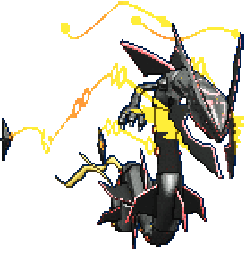
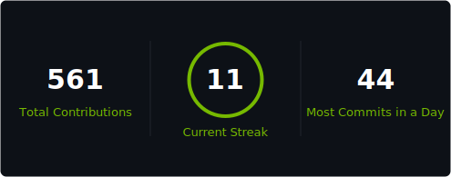
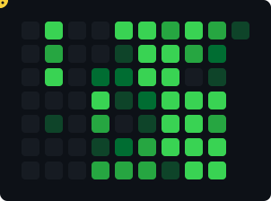

  
  

# Hey, I'm Matthew Hamilton

I build developer tools, terminal software, and real-time AI systems that I find cool and useful.

Incoming Systems Design Engineering @ University of Waterloo

Originally from Toronto, seeking Summer '27 internship opportunities. I enjoy exploring nature, video games, and trying new things.

If you want to talk about anything, reach me here:

- LinkedIn: [matthewhamilton3141](https://www.linkedin.com/in/matthewhamilton3141/)
- Email: [matthewhamilton3141@gmail.com](mailto:matthewhamilton3141@gmail.com)

## Pinned projects:

- [`gsplat-rt`](https://github.com/matthewhamilton3141/gsplat-rt) - a real-time pipeline that turns live video into 3D Gaussian splats and OpenUSD scenes for NVIDIA Isaac Sim and Omniverse
- [`Retermina`](https://github.com/matthewhamilton3141/Retermina) - a terminal workspace with native PTY sessions, modular panels, a customizable theme system, and an `Iris` command bar for contextual actions
- [`Sketchstack`](https://github.com/matthewhamilton3141/sketchstack) - Sketch systems, flows, schemas, and plans on a canvas; export a clean prompt for your AI agent.

I care about fast interaction, low-friction workflows, and systems that stay safe without getting in the way.

## Tech Stack

**Languages**

**Frontend**

**AI & GPU**

**Tooling**

## Stats

<table>
  <tr>
    <td align="center" width="34%">
      
    </td>
    <td width="66%">
      
    </td>
  </tr>
</table>

## Contribution Snake

<picture>
  
</picture>
